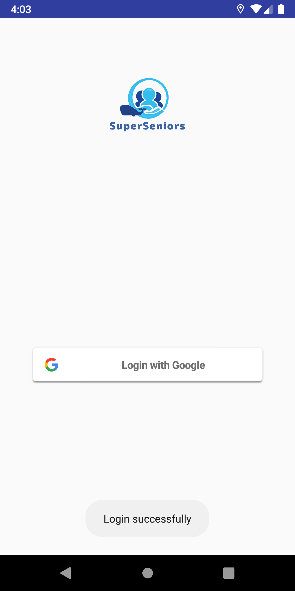
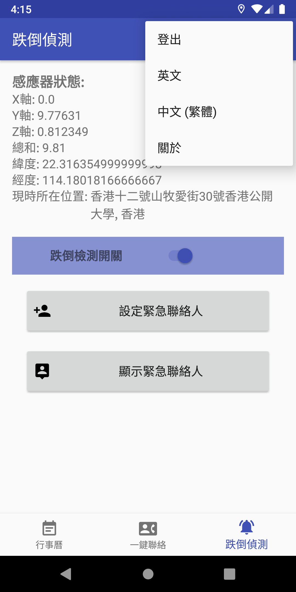
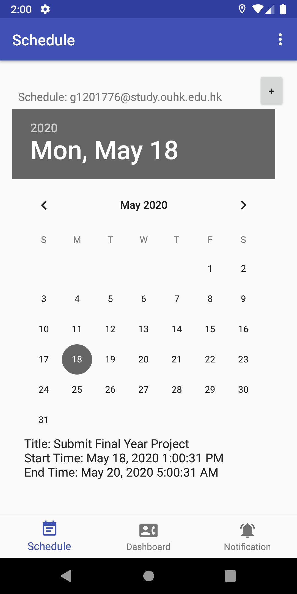
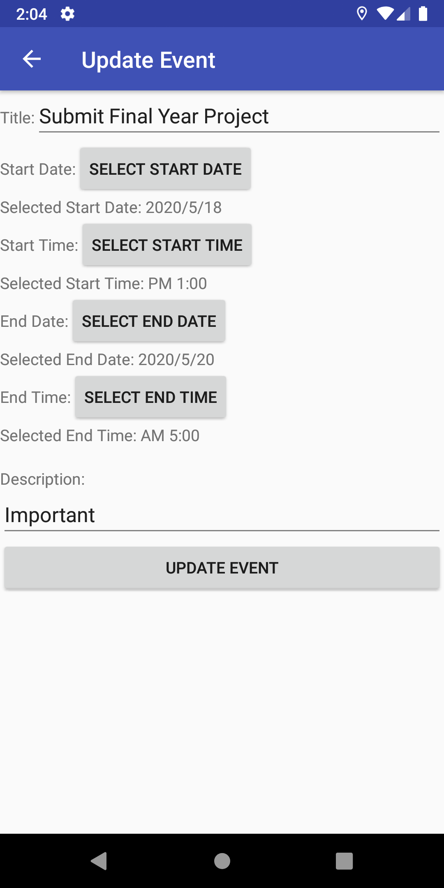
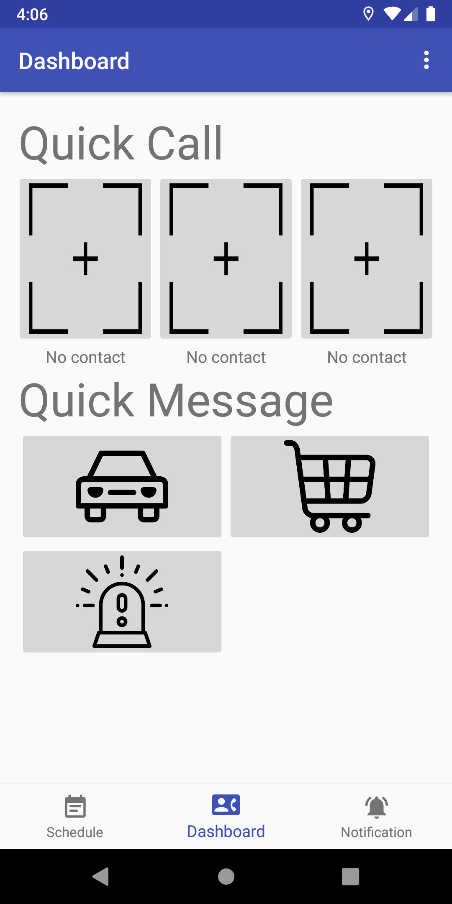
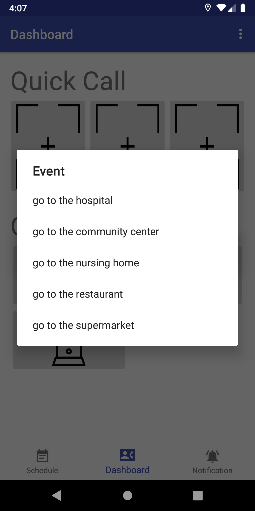
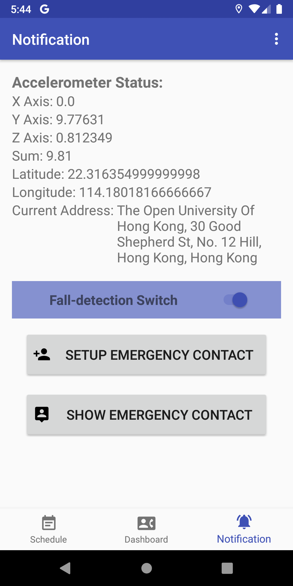
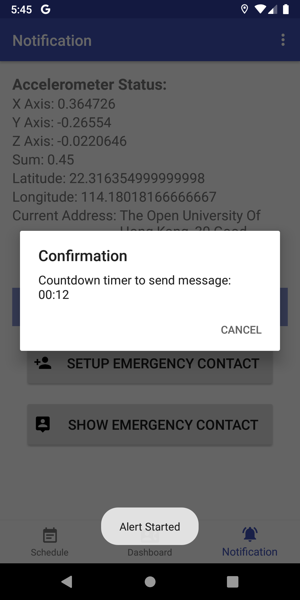

#  SuperSeniors

> The Open University of Hong Kong 2019/20 Final Year Project

> Android Application: Elderly Mobile Life Assistant for Family with Extra Peace of Mind

[](https://travis-ci.org/alvinau0427/SuperSeniors)
[](LICENSE)

## Getting Started
- This project aims to integrate the functions with a simple user interface that can focus on the problem of elderly safety. In addition to the basic functions of fall detection GPS monitoring for an easy way to alert the users with family members during an occurrence, the information such as the instant message of notification and the single-touch dialing for connecting the elderly with their family members are also important to them because they want to get the latest status for providing help for their family members. In the case of an elderly facing accident like a slip and has life-threatening, the family members need to know the location of the elderly. And it gave the original aim of GPS supported navigation system is to guide the family members to reach their destinations when they receive the emergency notice from their elderly member, it seems imperative to include the above-mentioned real-time information. Of course, the application will provide some simple functions for helping the elderly to use this application such as the event calendar with the daily to-do list features.

## Features
- User Authentication (Google Login by Firebase)
- Multi-language (Engligh and Traditioal Chinese)
- Daily Calendar (Connect with Google API)
- Quick Contact
	- Single Touch Dialing (Keep dialing when the other party does not answer)
	- Instant Messages (By SMS with some option button)
- Fall Detection with GPS Monitoring (Ringtone Alert with timer when detected fall action, send SMS to emergency contact list with current location by Google Map after timeout, keep detecting when the application have been killed)

- For more information of the project details, please browse the project report or powerpoint in `doc`

## Installation

### Setup
Please follow the steps from `installation_guide.pdf` in `doc`

## Screenshots
| Login Page     | Multi Language   |
| :-------------: | :-------------: |
|  |  |

| Daily Calendar Page    | Update Event   |
| :-------------: | :-------------: |
|  |  |

| Quick Contact Page    | Instant Messages   |
| :-------------: | :-------------: |
|  |  |

| Fall Detection Page    | Detected Fall Action   |
| :-------------: | :-------------: |
|  |  |

## Demonstration
- For more information of the project demonstration, please click [here](https://youtu.be/TJ6ovmJW0uA) to watch the following video.

[](https://youtu.be/TJ6ovmJW0uA)

## License
- SuperSeniors is released under the [Apache Version 2.0 License](http://www.apache.org/licenses/LICENSE-2.0.html).
```
Copyright 2020 WhaleDidYouGo

Licensed under the Apache License, Version 2.0 (the "License");
you may not use this file except in compliance with the License.
You may obtain a copy of the License at

   http://www.apache.org/licenses/LICENSE-2.0

Unless required by applicable law or agreed to in writing, software
distributed under the License is distributed on an "AS IS" BASIS,
WITHOUT WARRANTIES OR CONDITIONS OF ANY KIND, either express or implied.
See the License for the specific language governing permissions and
limitations under the License.
